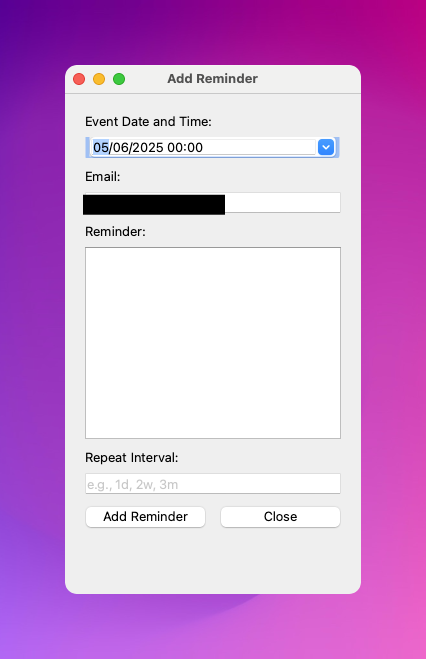

# 📬 Email Reminder App – Real World Python Series

This project is part of the **Real World Python** course series and demonstrates how to build a fully functional **Email Reminder App** using:

- 📧 Python + SMTP
- 🗓️ Repeating and scheduled reminders
- 🖥️ GUI with PyQt6
- 🌐 API-based integration with a remote server (PythonAnywhere)

The video course can be purchased on Udemy at the following link:

https://www.udemy.com/course/real-world-python-series-build-an-email-reminder-app/

---

## 🚀 Features

- Add one-time or **repeating reminders** (e.g., every 2 weeks, 3 months, etc.)
- GUI interface for easily entering reminders
- Automatically **sends email notifications** using Gmail SMTP
- Reminders stored on a **remote CSV file via API**
- Designed for deployment with **PythonAnywhere**

---

## 📁 Project Structure

```

├── gui.py        # PyQt6 GUI app for adding reminders
├── flask_app.py              # (Provided) Flask API running on PythonAnywhere
├──send_reminders.py                # Cron job script to send emails daily
├── reminders.csv          # CSV storage for all reminders
├── .env                   # Email credentials (not included in repo)

````

---

## 🛠️ Installation

1. **Clone the repo**  
   ```bash
   git clone https://github.com/yourusername/email-reminder-app.git
   cd email-reminder-app
   ```

2. **Create a virtual environment and install dependencies**

   ```bash
   python -m venv .venv
   source .venv/bin/activate  # or .venv\Scripts\activate on Windows
   pip install -r requirements.txt
   ```

3. **Set up your `.env` file**

   ```
   EMAIL_ADDRESS=yourgmail@gmail.com
   EMAIL_PASSWORD=yourpassword_or_appkey
   ```

4. **Run the GUI**

   ```bash
   python gui_reminder.py
   ```

---

## ⏰ Running the Daily Email Job

Deploy the `main.py` script to [PythonAnywhere](https://www.pythonanywhere.com) and schedule it to run daily at 8am via the task scheduler.

It will:

* Load the latest `reminders.csv`
* Check for due reminders
* Send them via email

---

## 🧠 What You Learn in the Course

* Reading/writing CSVs in Python
* Working with datetime and recurrence logic
* Creating a GUI with PyQt6
* Communicating with a remote server using an API
* Deploying Python apps to PythonAnywhere

---

## 🎓 Course Link

👉 Enroll in the full **Real World Python: Build an Email Reminder App** course on Udemy: 
https://www.udemy.com/course/real-world-python-series-build-an-email-reminder-app/

---

## 📷 Screenshots



